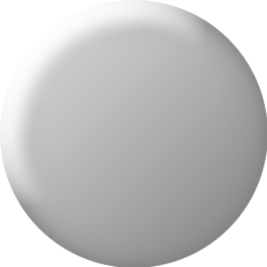

#Project Application development

I'm asking you, visitor, to not plagiarise my code.
I'm trusting you to respect this policy and one of the TA's is my friend and will recognise my coding as well.

That being said, welcome to my github for *PAD*

##UI improvements

as can be seen, I included graphics like:

**intro screen**

**background**

and the vertex overlays

| sphere1 | sphere2 | sphere3 | sphere4 | sphere5 | sphere6 | sphere7
| --- | --- | --- | --- | --- | --- | --- | 
|  |  |  |  |  |  |  |

